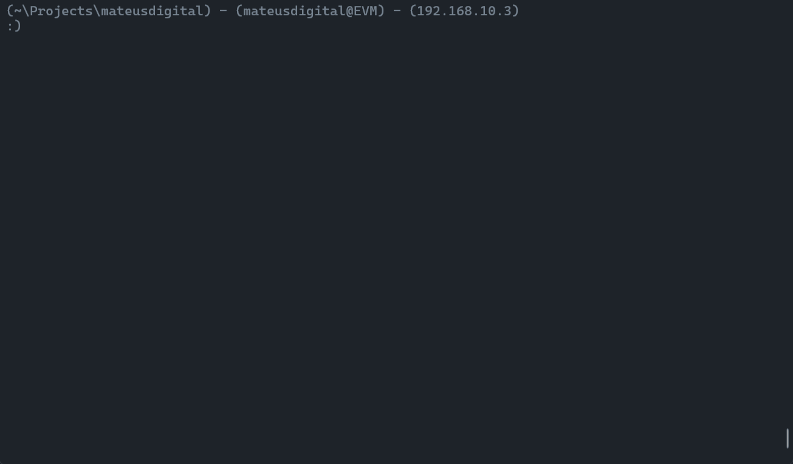

# repochecker

**Made with <3 by [mateus.digital](https://mateus.digital).**

## Description:

<p align="center">
    
</p>

```repochecker``` - simplifies multiple git repository management by providing clear insights into what needs to be pushed, pulled, or is modified.  

It handles submodules, syncs with remotes, and offers flexible customization options. With repochecker, stay organized and up-to-date across all your repositories juggling with ease.

<br>

As usual, you are **very welcomed** to **share** and **hack** it.


## Installing

- Step 1: Clone the project.
```poweshell
git clone https://github.com/mateusdigital/repochecker
cd repochecker
```

-- Step 2: Install it.
```powershell
pip install --user . ## Using pip manually
```

As convience there's a script for each platform to install it automatically.
```powershell
./install.ps1 ## Powershell
./install.sh  ## Unix
```

## Usage:
```powershell
Usage:
  repochecker [--help] [--version]
  repochecker [--debug] [--no-colors]
  repochecker [--remote] [--auto-pull]
  repochecker [--submodules]
  repochecker [--show-push] [--show-pull] [--show-all]
  repochecker [--short]
  repochecker <start-path>

  --debug      : Prints extra information about the program execution.
  --no-colors  : Disables coloring the output.

  --remote     : Fetches the status of the repo's remotes (slow).
  --submodules : Makes the operations applies to submodules as well.

  --show-push  : Shows the information about changes to push.
  --show-pull  : Shows the information about changes to pull.
  --show-all   : Implies --show-push and --show-pull.

  --short      : Displays the information into a condensed format.

Options:
  *-h --help     : Show this screen.
  *-v --version  : Show program version and copyright.

Notes:
  <start-path> if not given is assumed to be the current working directory.

  Options marked with * are exclusive, i.e. the repochecker will run that
  and exit after the operation.
```

## Dependencies:

- None - just a normal python3 installation.

## License:

This software is released under [GPLv3](https://www.gnu.org/licenses/gpl-3.0.en.html).


## Others:

- Email: hello@mateus.digital
- Website: https://mateus.digital
- Itch.io: https://mateusdigital.itch.io
- Linkedin: https://www.linkedin.com/in/mateusdigital
- Twitter: https://www.twitter.com/_mateusdigital
- Youtube: https://www.youtube.com/@_mateusdigital

There's more FLOSS things at [mateus.digital](https://mateus.digital) :)
