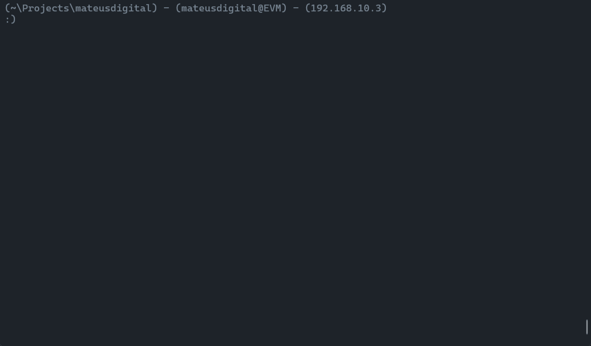

<p align="center">
  <b>repochecker</b>
</p>

<p align="center">
    <a href="https://github.com/SaturnoSoftware/repochecker/releases"></a>
    <a href="https://github.com/SaturnoSoftware/repochecker/commits"></a>
    <a href="./COPYING.txt"></a>
    <a href="./tests"></a>
    <a href="https://github.com/SaturnoSoftware/repochecker"></a>
</p>

<p align="center">
  <b>Check every Git repo from one command.</b> See local changes, remote drift, and submodules fast.
  <br>
  <br>
</p>

**repochecker** is a Python CLI for developers who maintain many Git repositories. It scans a directory tree, finds repositories, reports dirty branches, shows commits waiting to push or pull, and can include submodules when needed.

Maintained by [Saturno.Software](https://saturno.software/).

---

## Quick Start

<p align="center">
    
</p>

```bash
git clone https://github.com/SaturnoSoftware/repochecker
cd repochecker

./install.sh   # bash
./install.ps1  # powershell

repochecker ~/Projects
repochecker --remote --show-all ~/Projects
```

---

## Features

- **Workspace Scan** -- Finds Git repositories under a starting directory
- **Remote Drift** -- Shows commits waiting to pull or push
- **Submodule Support** -- Includes nested submodules when requested
- **Safe Auto Pull** -- Pulls only clean current branches with `--auto-pull`
- **Force Pull Mode** -- Discards local changes before pulling when explicitly requested
- **Short Output** -- Condenses status for quick terminal review
- **JSON Metadata** -- Exposes Saturno CLI discovery data through `--json`
- **Zero Runtime Dependencies** -- Requires Python 3 and Git only

---

## Installation

### From Source

```bash
git clone https://github.com/SaturnoSoftware/repochecker
cd repochecker

./install.sh   # bash
./install.ps1  # powershell
```

### From a Packaged Release

The install scripts also work from a packaged release root under `__DIST/<release-name>/`.

### Requirements

- Python 3
- Git
- Bash or PowerShell for shell wrappers

### Install Location

```text
~/.saturnosoftware/repochecker/
  package.json
  bin/
    repochecker.py
    repochecker.sh
    repochecker.ps1
  config/
  data/
```

---

## Usage

```text
Usage:
  repochecker [--help] [--version]
  repochecker [--debug] [--no-colors]
  repochecker [--remote] [--auto-pull] [--force-pull]
  repochecker [--submodules]
  repochecker [--show-push] [--show-pull] [--show-all]
  repochecker [--short]
  repochecker [-Json | --json]
  repochecker [<start-path>]

Options:
  *-h --help     : Show this screen.
  *-v --version  : Show program version and copyright.
  *-Json --json  : Print structured CLI metadata for help/version consumers.
```

### Common Commands

```bash
# Scan from the current directory
repochecker

# Scan another workspace
repochecker ~/Projects

# Fetch remote state and show both pull and push drift
repochecker --remote --show-all ~/Projects

# Include submodules
repochecker --submodules ~/Projects

# Print condensed output
repochecker --short --show-all ~/Projects

# Print Saturno CLI metadata
repochecker --json
```

---

## Local Development

```powershell
npm test
npm run build
pwsh ./Saturno.CICD/build.ps1 -ProjectRoot . -BuildNumber 1
pwsh ./Saturno.CICD/package.ps1 -ProjectRoot . -BuildNumber 1
```

---

## Repository Layout

```text
repochecker/
  repochecker/       Python CLI and shell wrappers
  Scripts/           Local build, test, and package entrypoints
  Saturno.CICD/      Saturno build/test/package contract wrappers
  tests/             Python unittest suite
  .github/           GitHub Actions quality and release workflows
```

---

## Contributing

Contributions welcome. Add tests for behavior changes, keep the CLI metadata truthful, and run the Saturno build/test/package flow before submitting a pull request.

---

## License

GPLv3 -- See [COPYING.txt](./COPYING.txt) for details.

---

## FAQ

**Q: Does repochecker need admin/root access?**  
A: No. It runs against repositories you can already access and installs under your home directory.

**Q: Does `--auto-pull` overwrite local work?**  
A: No. `--auto-pull` skips dirty branches. Only `--force-pull` is destructive, and it must be passed explicitly.

**Q: Can automation discover the command surface?**  
A: Yes. Use `repochecker --json` or `repochecker -Json`.

---

## Links

- [GitHub Repository](https://github.com/SaturnoSoftware/repochecker)
- [Saturno.Software](https://saturno.software/)

---

<p align="center">
  <b>Made with &lt;3 by Saturno.Software</b>
</p>
